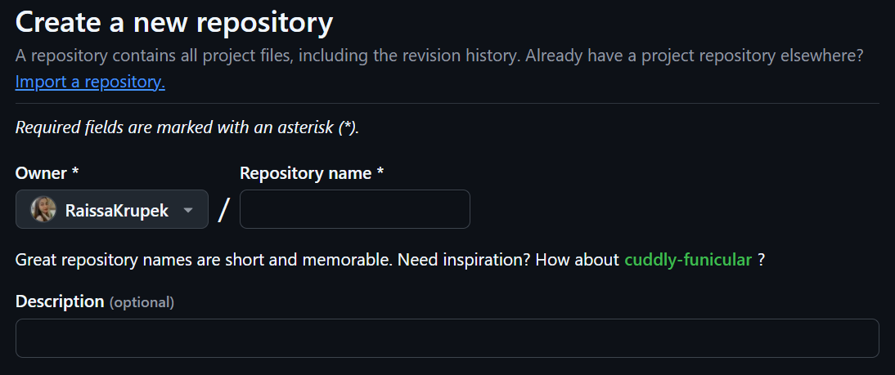
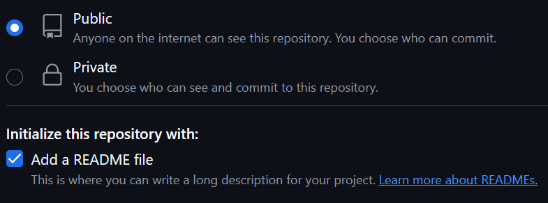
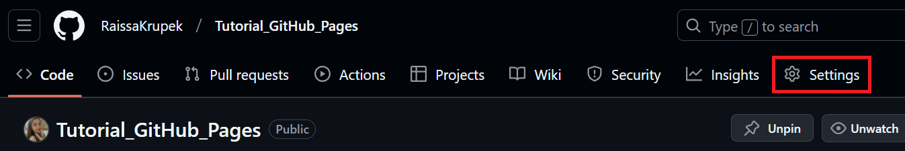
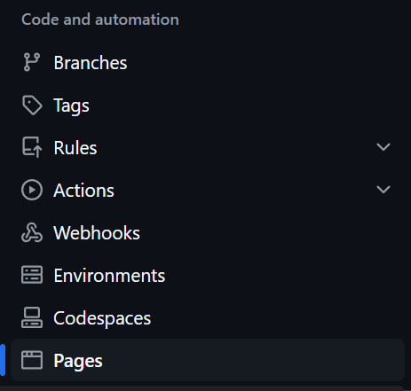
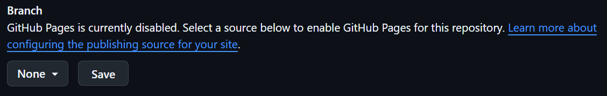
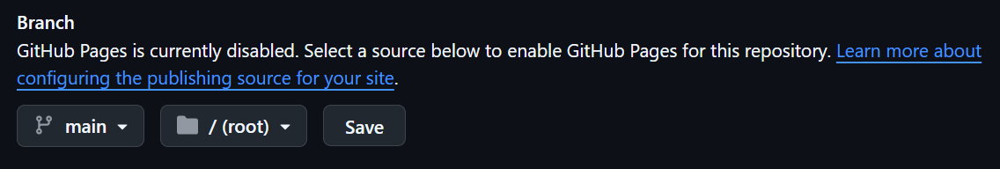
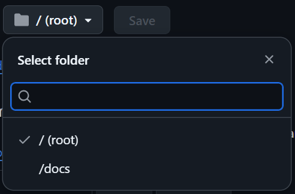
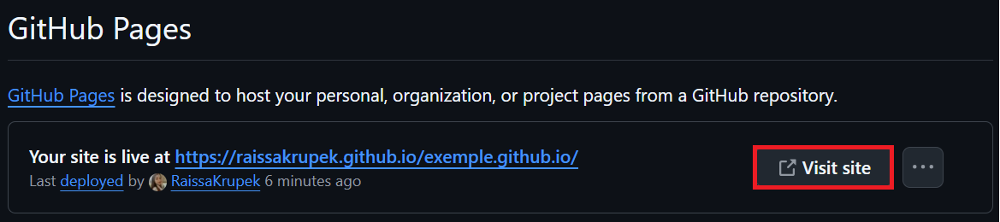

# 👩🏻‍💻Tutorial GitHub Pages👩🏻‍💻

Olá!

Este é um guia prático sobre o GitHub Pages, um serviço de hospedagem de sites que permite que você publique conteúdo com base no código-fonte gerenciado em um repositório do GitHub. Aqui, você encontrará **comandos essenciais**, conceitos importantes e um passo a passo para publicar seu website forma eficiente e simples. 🚀

Muitas informações não serão abordadas, pois o intuito é fornecer apenas o essencial. Entretanto, para quaisquer dúvidas, você pode consultar a [documentação oficial](https://docs.github.com/pt/pages/getting-started-with-github-pages/creating-a-github-pages-site) do GitHub Pages.

Espero que gostem e que isso ajude no dia a dia de cada um! ☺️

Atensiosamente, Raissa Souza Krupek.

## Conceitos Iniciais 📝

- O que é hospedagem? 🤔
  
Hospedagem é um serviço online que possibilita a disponibilização de um site ou aplicativo na internet. Basicamente, trata-se de um espaço em um servidor onde ficam armazenados todos os arquivos essenciais para que sua página seja acessível. Para facilitar a compreensão, podemos compará-la a um terreno: o site seria a casa construída nele, o domínio representaria o endereço e a internet funcionaria como a rua que conecta tudo.
Existem diversos serviços de hospedagem na internet e um deles é o Github Pages.

- Introdução ao GitHub Pages
  
O GitHub Pages é um serviço gratuito de hospedagem de sites estáticos diretamente a partir de um repositório do GitHub. Ele permite que você publique conteúdo de forma simples e eficiente, sem necessidade de servidores externos. Com ele, eh possivel puplicar com o domínio github.io, se estiver utilizando o GitHub free, ou mesmo [personalizar seu domínio](https://docs.github.com/pt/pages/configuring-a-custom-domain-for-your-github-pages-site). Estes e alguns outros conceitos serão melhor abordados mais a frente 😉

## Criando um repositório para seu site 📁
Antes de tudo, é importante saber que é possível criar um site do GitHub Pages em um repositório **novo** ou **existente**. Aqui, primeiramente, abordaremos a criação do website do inicio, criando um novo repositório!

**1º**- Na página inicial, vá até a opção `Criar novo repositório`

- Nesta etapa, você irá inserir as informações do projeto, como o nome do repositório, adicionar uma descrição breve e, em seguida, `criar repositório`.

**2º**- Use o menu suspenso Proprietário para selecionar a conta que deseja atribuir como proprietário do repositório.

**3º**- Digite um nome para o repositório e uma descrição opcional.

 

- Se você estiver criando um site de usuário ou de organização, seu repositório precisará ser chamado `<user>.github.io` ou `<organization>.github.io`. Antes de definir o nome do repositório, é importante destacar que a **URL do site** publicado será gerada a partir da combinação do seu nome de usuário e do nome do repositório, por exemplo, `https://username.github.io/reponame/`. No entanto, caso mude de ideia, é possível alterá-lo posteriormente, ajustando a configuração do repositório e, se necessário, atualizando os links associados.
  
  > ⚠️ Observação: Se o nome do usuário ou da organização contiver letras maiúsculas, você precisará colocá-las em minúsculas!

**4º**- Selecione Inicializar este repositório com um `README.md`.

  > ⚠️ Observação: Se a conta do proprietário do repositório for o GitHub Free ou o GitHub Free para organizações, o repositório precisará ser **público**.

   

Opcionalmente, você pode configurar um [domínio personalizado](https://docs.github.com/pt/pages/configuring-a-custom-domain-for-your-github-pages-site) para um site do GitHub Pages, o qual permitira, por exemplo, a personalização da URL de seu website, mas antes de explorar esse assunto, você deve colocar seu site em funcionamento com o domínio padrão

## Configurando seu repositório ⚙️

**1º**- No seu repositório, acesse a opção `Settings`.

 

**2º**- Na seção `Code and automation` da barra lateral, clique em `Pages`.

 

**3º**- Confugure uma fonte de publicação para o site

>   Você pode publicar seu site de duas formas: enviando suas alterações para um **branch específico** ou configurando um **fluxo de trabalho com GitHub Actions**.
  Se você não precisa de um controle avançado sobre a construção do site, a forma mais simples é configurar a publicação automática quando houver um **push** para um branch escolhido. Você pode definir qual **branch** e qual **pasta** serão usados como fonte de publicação.  
  O branch pode ser qualquer um do seu repositório, e a pasta pode ser a **raiz do repositório (/**) ou a pasta **/docs** dentro desse branch. Sempre que fizer um **push** com mudanças, os arquivos da pasta escolhida serão atualizados automaticamente no seu site pelo **GitHub Pages**.

  **I.** Em "Build and deployment", no menu suspenso `Source`, selecione `Deploy From a Branch` (fazer implantação de um branch).
  
  **II.** No menu suspenso de branch, selecione uma fonte de publicação.

    

  > ⚠️ Observação: Por padrão, os repositórios do GitHub geralmente começam com um branch chamado `main`.

   
  
  **III.** Opcionalmente, use o menu suspenso de pasta a fim de selecionar uma **pasta** para a fonte de publicação.

   
  
  **IV.** Clique em `Salvar`.

## Acesse sua URL 📲
Para acessar a URL de seu website, volte em `Pages`, acessado atraves de `Settings`, e clique em  `Visit site`.

## Dicas extras 😉

- Deixe sempre os arquivos `.html` na pasta raíz da sua fonte de publicação ou na pasta elegida dentro do branch.
- Não se preocupe se demorar para que sua página esteja no ar. Este processo pode demorar de alguns segundos a minutos. Caso nao esteja conseguindo acessar sua URL, atualize a pagina.
- Se o seu site não tiver uma página 404 ainda (uma página de erro que será exibida sempre que um usuário tentar acessar um caminho que não existe na sua url), é possível adicionar essa página com o Github Pages. Saiba como [neste link](https://docs.github.com/pt/pages/getting-started-with-github-pages/creating-a-custom-404-page-for-your-github-pages-site).
- Se alguma ação acarretar em um erro 404, procure por solucoes atraves [desta pagina](https://docs.github.com/pt/pages/getting-started-with-github-pages/troubleshooting-404-errors-for-github-pages-sites).

## Mas por onde construo meu website? 🤔
Agora que um **serviço de hospedagem** foi configurado para seu site, o proximo passo eh **cria-lo**, adicionando os arquivos em seu repositorio do Github referente ao website. Para isso, você pode escolher diferentes abordagens, dependendo do seu nível de conhecimento e da complexidade do site que deseja desenvolver. Aqui estão algumas opções:

🔹 HTML + CSS + JS → Site estático e simples.

🔹 Jekyll (baseado em Markdown) → Blogs e documentação (suporte nativo no GitHub Pages).

🔹 ⭐ [Quarto](https://quarto.org/docs/publishing/github-pages.html) → Ciência de dados e relatórios interativos, blogs científicos e documentação técnica.

🔹 Hugo, Gatsby, Next.js (frameworks modernos para sites otimizados, escaláveis e de alto desempenho) → Sites rápidos e dinâmicos. 

> ⚠️ Observação: é possível adicionar um tema para personalizar a aparência do site.

🛠 **Onde** Construir seu Site? 

Você pode construir seu site em diferentes ambientes e depois enviar (commit/push) para o GitHub. Mais detalhes de como realizar esse processo utilizando o ambiente RStudio, acesse [Tutorial_Git_Github](https://github.com/RaissaKrupek/Tutorial_Git_Github)

- RStudio → Ótimo para projetos em Quarto e Markdown.
- VS Code → Versátil para HTML, CSS, JS, Jekyll, Hugo, Next.js e outros frameworks.
- Jupyter Notebook → Pode ser usado para relatórios interativos com Quarto.

